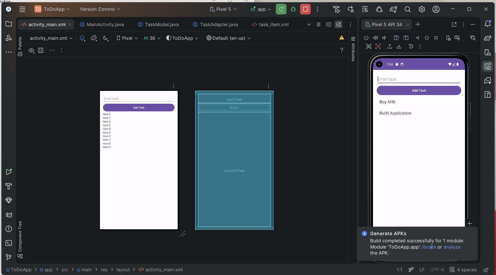

# 📱 To-Do List Android App

A simple and beginner-friendly To-Do List mobile application built using **Java** in Android Studio.

## 🚀 Features

* ➕ Add new tasks
* 📋 View tasks in a list
* ⚡ Fast and lightweight
* 🎯 Clean and simple UI
* Save tasks
* Delete tasks

## 🛠️ Tech Stack

* Java
* XML (UI Design)
* RecyclerView
* Android SDK

## 📸 Screenshots

![App Screenshot](

## 📂 Project Structure

app/
 ├── java/com/example/todoapp/
 │    ├── MainActivity.java
 │    ├── TaskAdapter.java
 │    └── TaskModel.java
 ├── res/layout/
 │    ├── activity_main.xml
 │    └── task_item.xml
 └── AndroidManifest.xml

## ▶️ How to Run

1. Clone this repository
2. Open in Android Studio
3. Click on **Run ▶️**
4. Select Emulator or Device

## 📌 Future Improvements

* ✔️ Mark task as completed
* ✔️ Firebase integration

## 🤝 Contributing

Pull requests are welcome. For major changes, please open an issue first.

## ⭐ Support

If you like this project, give it a ⭐ on GitHub!

## Author
Sneha sri
